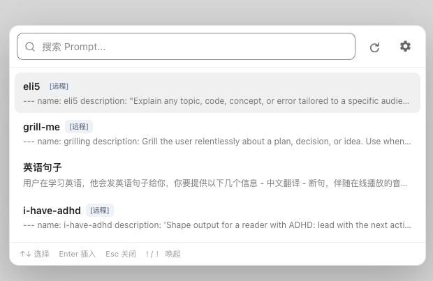
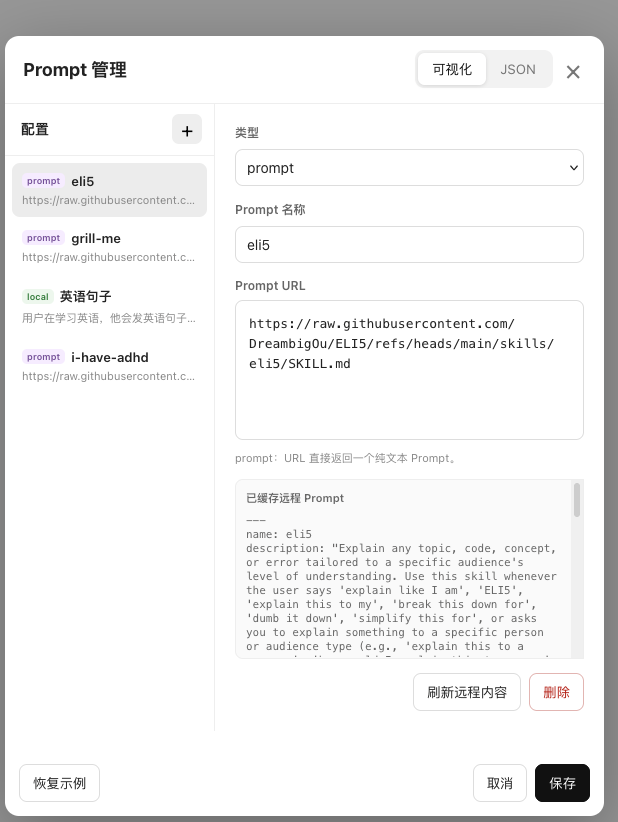
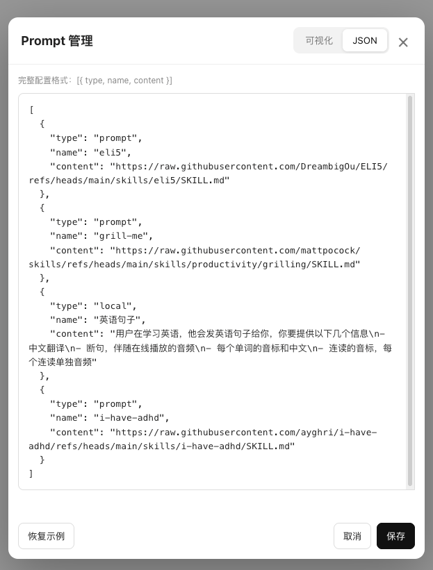

# Chat Prompt

一个用于 ChatGPT / DeepSeek 的 Tampermonkey Prompt 管理脚本。

在聊天输入框中输入 `!` 或中文全角 `！`，即可快速唤起 Prompt 选择器，并将选中的 Prompt 自动插入当前输入框。

支持：

- 本地 Prompt
- 远程 Prompt 配置集
- 远程单 Prompt
- 可视化配置
- JSON 配置
- Prompt 搜索
- 键盘快速选择
- 远程缓存
- 手动刷新远程配置
- ChatGPT / DeepSeek

## 快速使用

在 ChatGPT 或 DeepSeek 的聊天输入框中输入：

```text
!
```

或者：

```text
！
```

即可打开 Prompt 选择器。

快捷键：

- `↑ / ↓`：选择 Prompt
- `Enter`：插入 Prompt
- `Esc`：关闭
- 直接输入文字：搜索 Prompt

选择 Prompt 后会自动插入：

```text
Prompt 内容

---

```

方便继续输入问题、代码或其他上下文。

## 支持的网站

目前支持：

- `https://chatgpt.com/*`
- `https://chat.openai.com/*`
- `https://chat.deepseek.com/*`

## 配置格式

所有 Prompt 和远程源都使用统一的数据格式：

```json

[
  {
    "type": "local",
    "name": "总结",
    "content": "请总结下面的内容。"
  },
  {
    "type": "prompt",
    "name": "架构评审",
    "content": "https://example.com/architecture-review.txt"
  },
  {
    "type": "prompts",
    "name": "team",
    "content": "https://example.com/prompts.json"
  }
]
```

每一项统一包含三个字段：

| 字段 | 说明 |
|---|---|
| `type` | 配置类型：`local` / `prompts` / `prompt` |
| `name` | Prompt 名称或远程来源名称 |
| `content` | Prompt 内容或远程 URL |

支持三种类型：

| type | 说明 | content |
|---|---|---|
| `local` | 本地 Prompt | Prompt 正文 |
| `prompt` | 远程单 Prompt | 文本 URL |
| `prompts` | 远程 Prompt 配置集, 注意 prompts 不能套 prompts，即只支持 `type in [local, prompt]` 两种 | JSON URL, [例子](https://raw.githubusercontent.com/chenshutian9610/chat-prompt-js/refs/heads/main/config.example.json) |

## 截图

在 deepseek 聊天框按下 `！` 或 `!` 后



选择 `英语句子`


设置页面



设置页面 JSON 格式

